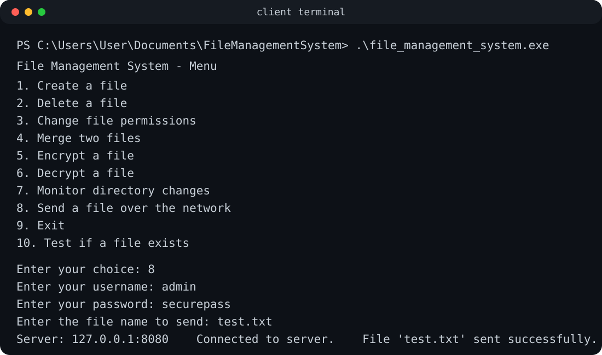
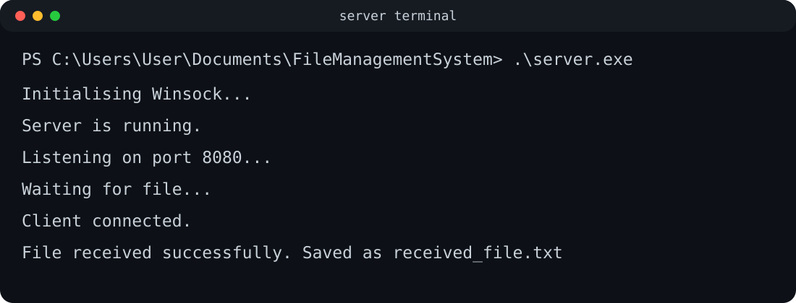
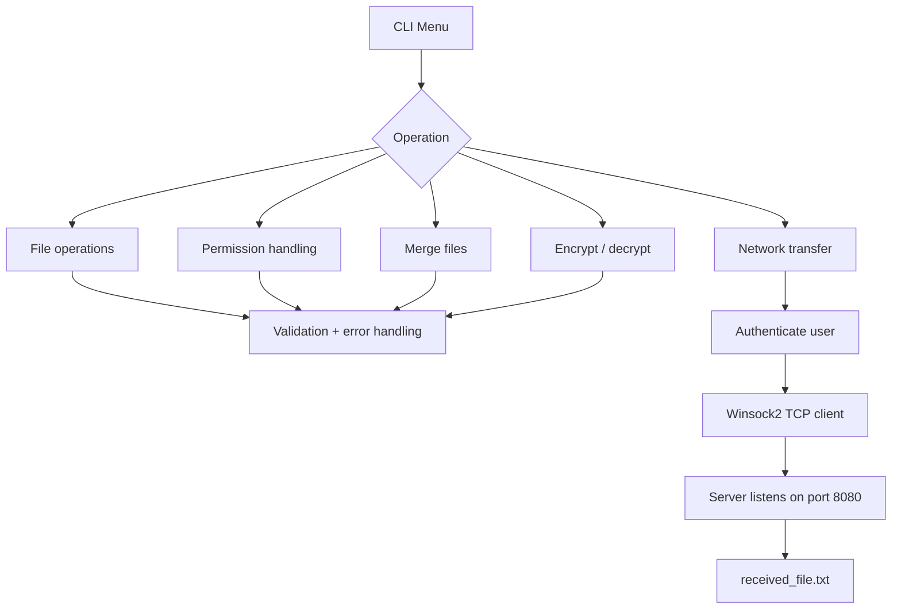

# C File & Network Management System


A Windows-focused systems programming project written in **C**. It combines file operations, validation, permission handling, buffered I/O and **TCP file transfer with Winsock2** in a menu-driven command-line application.

This repository is based on Operating Systems coursework and is presented as a portfolio project to showcase **advanced C programming**, **OS-facing APIs**, **error handling**, and **client-server socket programming** for graduate software engineering roles.

## Portfolio highlights

- Implemented file creation, deletion and file-existence validation.
- Changed file permissions using Windows file APIs.
- Merged files using buffered C file I/O.
- Implemented reversible password-based XOR processing as an **educational** encryption/decryption exercise.
- Built a TCP file-transfer **client** using Winsock2.
- Built a companion TCP **server** to receive transferred files.
- Added authentication gating before network transfer.
- Added input and error handling for files, permissions, sockets and connections.
- Structured the application around reusable C functions and a menu-driven interface.
- Added **CMake** and automated **Windows CI** with GitHub Actions.

## Demo previews

The following terminal-style previews are rendered from the project's expected client/server output so the workflow is easy to understand at a glance.

### Client application



### Server application



## Skills demonstrated

| Area | Evidence in the project |
| --- | --- |
| C | Functions, pointers, buffers, standard I/O and control flow |
| File I/O | `fopen`, `fread`, `fwrite`, `remove`, buffered merge operations |
| OS APIs | Windows `_access` and `_chmod` integration |
| Networking | Winsock2 startup, sockets, TCP connection, `send`, `recv`, cleanup |
| Validation | Menu, file-existence and permission validation |
| Error handling | File, socket and connection failure paths |
| Build tooling | Visual Studio/MSVC and CMake |
| CI | Automated Windows build on GitHub Actions |

## Features

| Feature | Status | Implementation |
| --- | --- | --- |
| Create file | ✅ | Standard C file I/O |
| Delete file | ✅ | `remove()` with validation |
| Check file existence | ✅ | Windows `_access` |
| Change permissions | ✅ | Windows `_chmod` |
| Merge two files | ✅ | Buffered `fread` / `fwrite` |
| Encrypt/decrypt file | ✅ | Educational XOR transformation |
| TCP file transfer client | ✅ | Winsock2 client socket |
| TCP file receiver server | ✅ | Winsock2 listening server |
| Authentication gate | ✅ | Credentials checked before transfer |
| Directory monitoring | ⚠️ | Coursework source contains a stub only |

## High-level architecture



## Project structure

```text
.
├── src/
│   ├── file_management_system.c
│   └── server.c
├── docs/
│   └── screenshots/
│       ├── client-demo.svg
│       └── server-demo.svg
├── CMakeLists.txt
├── BUILD.md
├── README.md
├── .gitignore
└── .github/
    └── workflows/
        └── windows-c-build.yml
```

## Build and run

This project uses Windows-specific APIs, so **Windows is the supported platform**.

### Option 1 — CMake

```cmd
cmake -S . -B build -A x64
cmake --build build --config Release
```

With a Visual Studio generator, the executables are produced inside the generated build configuration directory.

### Option 2 — Visual Studio Developer Command Prompt

```cmd
cl src\file_management_system.c /Fe:file_management_system.exe
cl src\server.c /Fe:server.exe
```

Both source files use `#pragma comment(lib, "ws2_32.lib")` so MSVC links Winsock automatically.

Run the server first:

```cmd
server.exe
```

Then run the client application:

```cmd
file_management_system.exe
```

See [`BUILD.md`](BUILD.md) for concise MSVC build notes.

## Example workflow

### Server terminal

```text
Initialising Winsock...
Server is running.
Listening on port 8080...
Waiting for file...
Client connected.
File received successfully.
Saved as received_file.txt
```

### Client terminal

```text
File Management System - Menu
1. Create a file
2. Delete a file
3. Change file permissions
4. Merge two files
5. Encrypt a file
6. Decrypt a file
7. Monitor directory changes
8. Send a file over the network
9. Exit
10. Test if a file exists

Enter your choice: 8
Enter your username: admin
Enter your password: securepass
Enter the file name to send: test.txt
Enter the server IP address: 127.0.0.1
Enter the server port: 8080
Connected to server.
File 'test.txt' sent successfully.
```

A recruiter reviewing the project can quickly follow the code from `main()` into small functions for individual OS, file and network operations.

## Security scope

> [!IMPORTANT]
> The encryption and authentication portions are coursework demonstrations, **not production security controls**.

The XOR transformation is intentionally simple and should not be used to protect real sensitive data. Likewise, the project demonstrates C, operating-system and networking concepts rather than acting as a hardened file-transfer product.

The directory-monitoring option is also explicitly retained as a **stub implementation** so the repository does not claim functionality that the coursework source did not complete.

## Academic context

This project is based on Operating Systems coursework at the University of Roehampton. The assessment involved C programming across file reading/writing, encryption/decryption, file creation/deletion, validation, error handling, operating-system protection/security and client-server networking concepts.

## Author

**Mohamed Ibrahim**  
BEng Software Engineering, University of Roehampton
