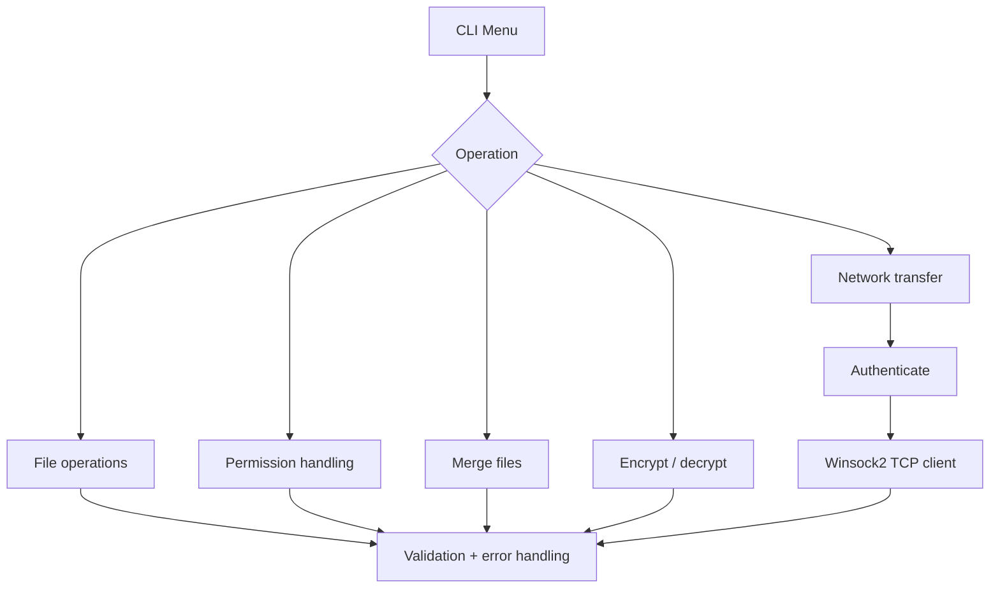

# C File & Network Management System


A Windows-focused systems-programming project written in **C**. It combines file operations, validation, permission handling, buffered I/O and TCP file transfer through Winsock2 in a menu-driven command-line application.

The repository is based on Operating Systems university coursework and is presented as a portfolio example of low-level C programming, OS-facing APIs, error handling and client-side socket programming.

## Portfolio highlights

- Implemented file creation, deletion and file-existence validation.
- Changed file permissions using Windows file APIs.
- Merged files using buffered C file I/O.
- Implemented reversible password-based XOR processing as an **educational** encryption/decryption exercise.
- Built a TCP file-transfer client using **Winsock2**.
- Added authentication gating before network transfer.
- Added input/error handling for files, permissions, sockets and connections.
- Structured the application around reusable C functions and a menu-driven interface.
- Added **CMake** and automated Windows compilation with GitHub Actions.

## Skills demonstrated

| Area | Evidence in the project |
| --- | --- |
| C | Functions, pointers, buffers, standard I/O and control flow |
| File I/O | `fopen`, `fread`, `fwrite`, `remove`, buffered merge operations |
| OS APIs | Windows `_access` and `_chmod` integration |
| Networking | Winsock2 startup, sockets, TCP connection, `send`, cleanup |
| Validation | Menu, file-existence and permission validation |
| Error handling | File, socket and connection failure paths |
| Build tooling | Visual Studio/MSVC and CMake |
| CI | Automated Windows build on GitHub Actions |

## Features

| Feature | Status | Implementation |
| --- | --- | --- |
| Create file | ✅ | Standard C file I/O |
| Delete file | ✅ | `remove()` with validation |
| Check file existence | ✅ | Windows `_access` |
| Change permissions | ✅ | Windows `_chmod` |
| Merge two files | ✅ | Buffered `fread` / `fwrite` |
| Encrypt/decrypt file | ✅ | Educational XOR transformation |
| TCP file transfer | ✅ | Winsock2 client socket |
| Authentication gate | ✅ | Credentials checked before transfer |
| Directory monitoring | ⚠️ | Coursework source contains a stub only |

## High-level flow



## Project structure

```text
.
├── src/
│   └── file_management_system.c
├── CMakeLists.txt
├── BUILD.md
├── README.md
├── .gitignore
└── .github/
    └── workflows/
        └── windows-c-build.yml
```

## Build and run

This project uses Windows-specific APIs, so **Windows is the supported platform**.

### Option 1 — CMake

```cmd
cmake -S . -B build
cmake --build build --config Release
```

With a Visual Studio generator, the executable is produced inside the generated build configuration directory.

### Option 2 — Visual Studio Developer Command Prompt

```cmd
cl src\file_management_system.c /Fe:file_management_system.exe ws2_32.lib
file_management_system.exe
```

See [`BUILD.md`](BUILD.md) for the short MSVC build notes.

## Example workflow

```text
File Management System - Menu
1. Create a file
2. Delete a file
3. Change file permissions
4. Merge two files
5. Encrypt a file
6. Decrypt a file
7. Monitor directory changes
8. Send a file over the network
9. Exit
10. Test if a file exists
```

A recruiter reviewing the project can quickly follow the code from `main()` into small functions for individual OS/file/network operations.

## Security scope

> [!IMPORTANT]
> The encryption and authentication portions are coursework demonstrations, **not production security controls**.

The XOR transformation is intentionally simple and should not be used to protect real sensitive data. Likewise, the project is useful for demonstrating C, operating-system and networking concepts rather than as a hardened file-transfer product.

The directory-monitoring option is also explicitly retained as a **stub implementation** so the repository does not claim functionality that the coursework source did not complete.

## Academic context

This project is based on Operating Systems coursework at the University of Roehampton. The assessment involved C programming across file reading/writing, encryption/decryption, file creation/deletion, validation, error handling, operating-system protection/security and client-server networking concepts.

## Author

**Mohamed Ibrahim**  
BEng Software Engineering, University of Roehampton
