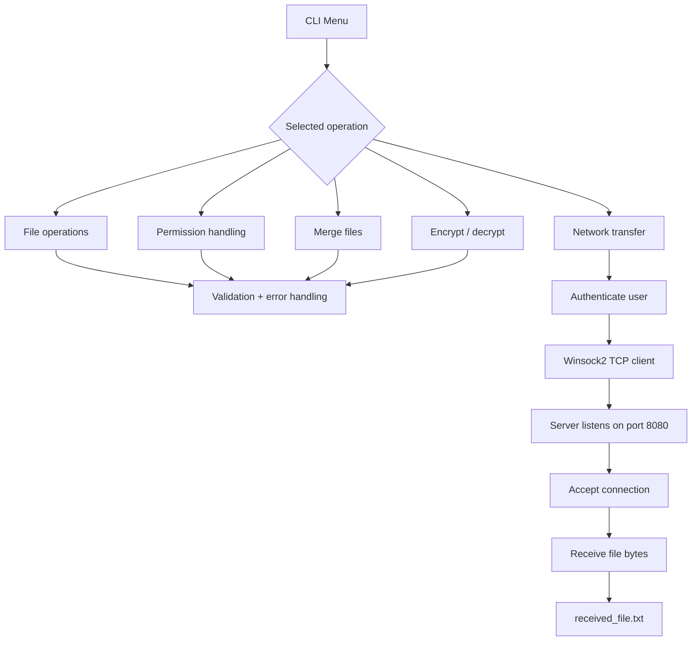

# C File & Network Management System


A Windows-focused **systems programming project in C** implementing file management, OS-facing APIs and TCP client-server networking with Winsock2.

The project began as Operating Systems coursework and has been developed into a portfolio repository for graduate and junior software engineering applications. It demonstrates practical C programming, file I/O, Windows APIs, networking, validation, error handling, build tooling and CI.

## Portfolio highlights

- Implemented file creation, deletion and file-existence validation.
- Changed file permissions using Windows `_chmod` and `_access` APIs.
- Merged files using buffered C file I/O.
- Implemented reversible password-based XOR processing as an **educational** encryption/decryption exercise.
- Built a TCP file-transfer **client** using Winsock2.
- Built a dedicated TCP **server** that listens for a client connection and receives file data.
- Added an authentication gate before network transfer.
- Added validation and error handling for files, permissions, sockets and connection failures.
- Structured functionality into reusable C functions behind a menu-driven CLI.
- Added **CMake** build configuration and **GitHub Actions** Windows CI.

## Screenshots — verified local test

These are cropped from the actual project run so the important evidence is visible without unrelated VS Code panels, menus or empty terminal space.

### Client application

<p align="center">
  
</p>

The client authenticates, connects to `127.0.0.1:8080` and successfully sends `mohamedibrahim.txt`.

### Server application

<p align="center">
  
</p>

The server listens on port `8080`, accepts the client connection and saves the received data as `received_file.txt`.

## Skills demonstrated

| Area | Evidence in the project |
| --- | --- |
| C | Functions, pointers, buffers, standard I/O and control flow |
| File I/O | `fopen`, `fread`, `fwrite`, `remove`, buffered merge operations |
| Windows APIs | `_access` and `_chmod` |
| Networking | Winsock2, TCP sockets, `connect`, `listen`, `accept`, `send`, `recv`, cleanup |
| Validation | Menu input, file-existence and permission validation |
| Error handling | File, socket and connection failure paths |
| Build tooling | MSVC / Visual Studio Build Tools and CMake |
| CI | Automated Windows build through GitHub Actions |
| Version control | Git and GitHub repository workflow |

## Features

| Feature | Status | Implementation |
| --- | --- | --- |
| Create file | ✅ | Standard C file I/O |
| Delete file | ✅ | `remove()` with validation |
| Check file existence | ✅ | Windows `_access` |
| Change permissions | ✅ | Windows `_chmod` |
| Merge two files | ✅ | Buffered `fread` / `fwrite` |
| Encrypt / decrypt file | ✅ | Educational XOR transformation |
| TCP file-transfer client | ✅ | Winsock2 client socket |
| TCP file receiver server | ✅ | Winsock2 listening server |
| Authentication gate | ✅ | Credentials checked before transfer |
| Directory monitoring | ⚠️ | Coursework source contains a stub only |

## High-level architecture



## Project structure

```text
.
├── src/
│   ├── file_management_system.c
│   └── server.c
├── docs/
│   └── screenshots/
│       ├── client-demo.png
│       └── server-demo.png
├── CMakeLists.txt
├── BUILD.md
├── README.md
├── .gitignore
└── .github/
    └── workflows/
        └── windows-c-build.yml
```

## Build and run

This project uses Windows-specific APIs, so **Windows is the supported platform**.

### Option 1 — CMake

```cmd
cmake -S . -B build -A x64
cmake --build build --config Release
```

With a Visual Studio generator, both executable targets are produced in the generated build configuration directory.

### Option 2 — Visual Studio Developer Command Prompt

```cmd
cl src\file_management_system.c /Fe:file_management_system.exe
cl src\server.c /Fe:server.exe
```

Both source files use `#pragma comment(lib, "ws2_32.lib")`, so MSVC links Winsock automatically.

Start the server first:

```cmd
server.exe
```

Then start the client application in a second terminal:

```cmd
file_management_system.exe
```

See [`BUILD.md`](BUILD.md) for concise MSVC build notes.

## Verified client-server workflow

### Server output

```text
Initialising Winsock...
Server is running.
Listening on port 8080...
Waiting for file...
Client connected.
File received successfully.
Saved as received_file.txt
```

### Client output

```text
Enter your choice: 8
Enter your username: admin
Enter your password: securepass
Enter the file name to send: mohamedibrahim.txt
Enter the server IP address: 127.0.0.1
Enter the server port: 8080
Connected to server.
File 'mohamedibrahim.txt' sent successfully.
```

A recruiter reviewing the project can follow the implementation from `main()` into focused functions for file, permission and network operations, then inspect the companion server to see the other side of the TCP transfer.

## Security scope

> [!IMPORTANT]
> The encryption and authentication portions are coursework demonstrations, **not production security controls**.

The XOR transformation is intentionally simple and should not be used to protect real sensitive data. The authentication credentials are also hard-coded for demonstration purposes. The repository is intended to demonstrate C, operating-system and networking concepts rather than act as a hardened file-transfer product.

The directory-monitoring option is explicitly retained as a **stub implementation** so the repository does not claim functionality that the coursework source did not complete.

## Potential next improvements

Useful extensions for a future version would include:

- automated unit and integration tests;
- environment/configuration-based credentials rather than hard-coded values;
- a file-transfer protocol that sends file metadata such as the original filename and size;
- support for multiple sequential clients;
- proper directory monitoring with Windows file-system APIs;
- stronger authenticated encryption for real security use cases.

## Academic context

This project is based on Operating Systems coursework at the University of Roehampton. The assessment covered C programming, file reading/writing, encryption/decryption, file creation/deletion, validation, error handling, operating-system protection/security and client-server networking concepts.

## Author

**Mohamed Ibrahim**  
BEng Software Engineering, University of Roehampton
